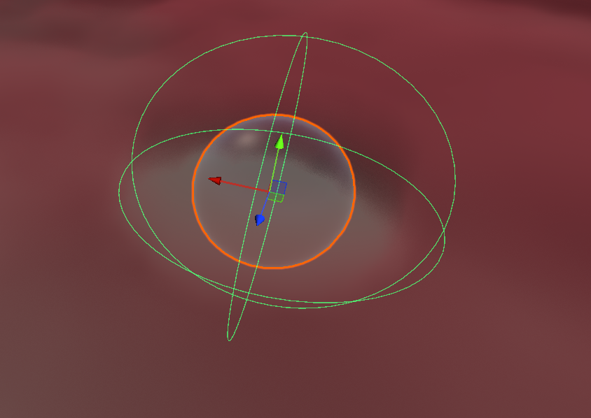
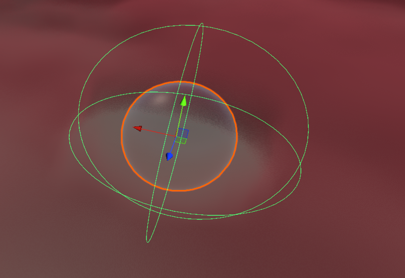

# Interacter Fog

Unity project for interactive fog rendering and visual-quality comparison.

## Overview

This project explores interactive fog effects, including scene interaction and comparisons across different rendering-quality settings. Screenshots, GIFs, and other result media will be collected in [`Results/`](Results/).

## Highlights

- Interactive fog effects in Unity
- Configurable rendering and visual-quality settings
- Side-by-side quality comparison results
- Space for demonstration images and GIFs

## Requirements

- Unity **2022.3.62f3c1** (recorded in `ProjectSettings/ProjectVersion.txt`)
- Universal Render Pipeline (URP)

Open the project through Unity Hub and allow Unity to restore packages from `Packages/manifest.json`.

## Repository structure

```text
Assets/                 Unity scenes, scripts, materials, and resources
Docs/                   Project notes and documentation
Img/                    Quality comparison screenshots
Editor/                 Editor-only scripts and tooling
Packages/               Unity package manifest
ProjectSettings/        Unity project configuration
Results/                Interaction demos, quality comparisons, and GIFs
```

## Results

### Interactive effects

Add screenshots or GIFs to [`Results/interaction/`](Results/interaction/) and embed them here, for example:

```markdown

```

### Multi-quality comparison

| | High / 高画质 | Medium / 中画质 | Low / 低画质 |
| --- | --- | --- | --- |
| **Average GPU frame time / GPU 平均耗时** | **6.772 ms** | **2.257 ms** | **1.523 ms** |
| Rendering preview / 渲染表现 |  |  |  |

Measured with Unity Profiler in Editor Play Mode. Each preset was captured for 300 frames; GPU averages use **298 valid GPU frames**, excluding the final two frames without GPU timing data. Lower is better. These values describe the **total GPU frame time**, including the scene and render pipeline, rather than fog-only time or standalone-build FPS. Screenshots are provided as visual references; their dimensions are not the benchmark output resolution.

*Image note: the supplied Medium and Low PNG files are currently identical. Separate captures are needed to show their visual differences.*

### GIFs and other media

Place GIFs in [`Results/gif/`](Results/gif/). Keep large videos or build artifacts outside Git, or publish them through GitHub Releases/LFS when needed.

## Status

The repository is being prepared for public release. Experimental results and performance measurements will be added as they are finalized.

## License

License to be added.
