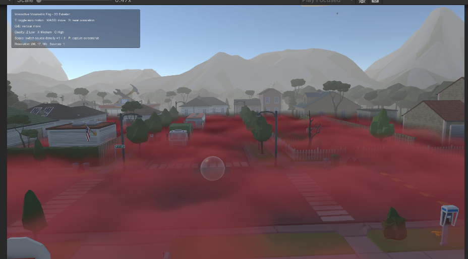
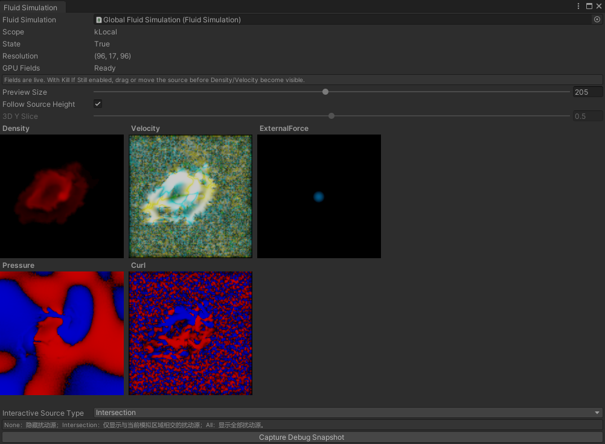

# 可交互体积雾——分档画质实现

基于 Unity 的交互式体积雾渲染与多档画质效果对比。

## 项目简介

本项目实现交互式体积雾效果，包括场景交互，以及不同渲染画质设置下的性能与视觉表现对比。

## 技术文档

- [体积雾渲染实现说明](Assets/InteractiveFog/体积雾渲染实现说明.md)：介绍欧拉密度/速度场如何通过逐像素 Ray Marching、场景深度截断、FBM 噪声、高度衰减和 Beer-Lambert 积分转换为最终雾画面。

## unity版本

- Unity **2022.3.62f3c1**
- Universal Render Pipeline（URP）

## 项目特点

- 体积雾
- 流体模拟（欧拉流体--实现2D求解器与3D求解器）
- 分档画质

## 雾的渲染表现

下图展示体积雾的整体渲染表现：

<p align="center">
  
</p>


## 交互效果

下面是项目中的交互效果演示：

<p align="center">
  
</p>

[直接打开或下载交互效果 GIF](Img/交互效果.gif)

## 交互纹理实时 Debug

Debug 工具用于实时查看交互过程中保存的流体纹理，帮助确认交互数据是否正确写入并参与体积雾渲染。

<p align="center">
  
</p>

Debug 窗口可以预览 Density（密度）、Velocity（速度）、ExternalForce（外力）、Pressure（压力）和 Curl（旋度）等纹理，也可以调整预览尺寸、交互源高度和 3D 切片位置。


## 仓库结构

```text
Assets/                 Unity 场景、脚本、材质和资源
Docs/                   项目笔记和相关文档
Img/                    多画质效果对比截图
Editor/                 仅用于编辑器的脚本和工具
Packages/               Unity 包管理清单
ProjectSettings/        Unity 项目配置
Results/                交互演示、画质对比和 GIF
```

## 实验结果

### 多画质对比

下面的不同画质对比可能不够明显，点击图片可以放大查看。中、低画质由于降低了 texture 分辨率，可以明显看到锯齿差异。

#### 1920×1080 理论 Ray March 采样量

以下按雾区域覆盖整个屏幕、每个像素都执行最大步数估算。Medium 的宽高缩放为 0.5，Low 为 0.25；“像素 × 步数”表示 Ray March Shader 的理论采样规模。

| 档位 | 雾渲染分辨率 | 像素数 | 最大步数 | 最大“像素 × 步数” | 相对 High |
| --- | ---: | ---: | ---: | ---: | ---: |
| High | 1920 × 1080 | 2,073,600 | 60 | 124,416,000 | 100% |
| Medium | 960 × 540 | 518,400 | 44 | 22,809,600 | 约 18.3% |
| Low | 480 × 270 | 129,600 | 32 | 4,147,200 | 约 3.3% |

该表是理论采样上限，不等于实测 GPU 耗时。实际工作量还会受到自适应步数、场景深度截断和浓雾提前终止影响；Medium/Low 也包含渲染目标、深度降采样和全分辨率合成开销，因此不能直接用 18.3% 或 3.3% 推导整帧耗时。

| | 高画质 | 中画质 | 低画质 |
| --- | --- | --- | --- |
| **GPU 平均帧耗时** | **6.772 ms** | **2.257 ms** | **1.523 ms** |
| 渲染表现 |  |  |  |

数据使用 Unity Profiler 在编辑器 Play Mode 下采集。每档画质采集 300 帧；GPU 平均值使用 **298 个有效 GPU 帧**计算，排除了最后两个没有 GPU 计时数据的帧。数值越低表示 GPU 耗时越少。这里的数值是包含场景和渲染管线在内的**整帧 GPU 耗时**，不是单独的体积雾耗时，也不是独立运行版本的 FPS。截图仅用于展示视觉表现，图片尺寸不代表基准测试时的输出分辨率。

